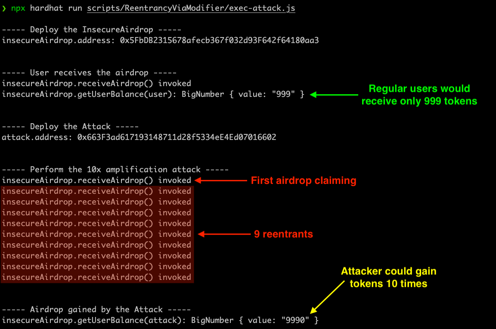

# Reentrancy via Modifier

This example demonstrates a **reentrancy vulnerability introduced inside a modifier**. Although Solidity modifiers are meant to protect logic, they can unintentionally become a vector for reentrancy if they rely on external contract calls or do not change the state early.

---

## 1. Concept

In this case, an airdrop contract uses two modifiers:
- `neverReceiveAirdrop`: ensures an address hasn’t already claimed
- `canReceiveAirdrop`: checks if the sender is a contract and calls back into the sender contract to verify if it "can receive"

This logic is flawed because it:
- Performs **external calls inside modifiers** (violating Checks-Effects-Interactions)
- Delays updating the state until after the call

As a result, the attacker can recursively reenter `receiveAirdrop()` multiple times.

---

## 2. Contract Design

### Vulnerable Contract: `InsecureAirdrop.sol`
- Performs the airdrop within `receiveAirdrop()`
- Uses `canReceiveAirdrop()` modifier to verify eligibility — but it makes an external call to `msg.sender`
- Updates state **after** sending tokens, allowing repeated claims

### Attacker Contract: `Attack.sol`
- Implements the `IAirdropReceiver` interface
- Tracks reentrancy loop with a counter
- Recursively calls back into `airdrop.receiveAirdrop()` within `canReceiveAirdrop()`

Diagram:


---

## 3. Attack Demonstration

Execution Output:

```bash
Deploy the Airdrop
User balance: 999

Deploy Attack
Attack receives airdrop (x10)...

receiveAirdrop() invoked
receiveAirdrop() invoked
...
receiveAirdrop() invoked (total 10 times)

Final attacker balance: 9990
```

Screenshot:



---

## 4. Vulnerability Analysis

### Detected by Slither:

- `receiveAirdrop()` can be reentered
- `canReceiveAirdrop()` modifier includes external call
- `userBalances[msg.sender] += airdropAmount` after the call

Screenshot:


---

## 5. Fix & Protection

To patch this vulnerability:
- Avoid external calls in modifiers
- Use Checks-Effects-Interactions: update state **before** making any calls
- Add `ReentrancyGuard` from OpenZeppelin for sensitive functions

**Secure version:** `FixedAirdrop.sol`

```solidity
function receiveAirdrop() external nonReentrant {
    require(!receivedAirdrops[msg.sender], "Already claimed");
    receivedAirdrops[msg.sender] = true;
    userBalances[msg.sender] += airdropAmount;
}
```

---

## 6. Run This Demo

```bash
git clone https://github.com/your-user/reentrancy-attacks
cd modifier-attack
npm install
npx hardhat compile
npx hardhat run scripts/exec-attack.js
```

---

## 7. File Overview

| File                   | Description                            |
|------------------------|----------------------------------------|
| `InsecureAirdrop.sol`  | Vulnerable airdrop contract            |
| `Attack.sol`           | Implements recursive claim via modifier|
| `FixedAirdrop.sol`     | Secure airdrop contract                |
| `exec-attack.js`       | Script to run the exploit              |


---

## Summary

This case illustrates how even **modifiers**, if carelessly designed, can introduce reentrancy risks. Developers must treat modifiers like normal functions and avoid placing external logic inside them.

Always validate:
- External calls in modifiers or constructors
- Modifier order and placement
- State updates before calls
