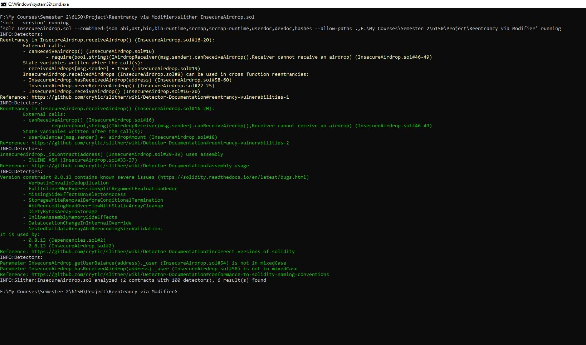

# README.md – Cross-Function Reentrancy

This example demonstrates a cross-function reentrancy attack where an attacker exploits multiple functions of the same vulnerable contract to recursively drain its funds. This attack highlights the danger of relying on single-function protection without understanding function interactions.

---

## 1. Concept

In cross-function reentrancy, the attacker doesn't reenter the same function repeatedly — instead, they bounce between different functions of the same contract.

Here’s how it happens:
1. `withdrawAll()` sends ETH via low-level `call`
2. During the external call, the attacker contract's `fallback()` or `receive()` function triggers `transfer()`
3. `transfer()` moves the attacker’s balance again — without reentrancy protection
4. `transfer()` calls back to `withdrawAll()` again, and the loop begins

Multiple entry points are exploited, which makes the attack stealthier.

---

## 2. Contract Structure

### Vulnerable Contract: `InsecureEtherVault.sol`

- Has functions `deposit()`, `withdrawAll()`, and `transfer(address, amount)`
- Uses `call{value:}` to send ETH without reentrancy guard
- Updates balances after transferring

### Attacker Contract: `Attack.sol`

- Starts by depositing 1 ETH
- Calls `withdrawAll()` to initiate reentrancy
- Uses the fallback function to re-call `transfer()` which re-calls `withdrawAll()`

Diagram:


---

## 3. Attack Demonstration

Execution log (see screenshots):

```bash
Vault balance: 6 ETH
Attacker balance: 1 ETH
[Fallback] received ETH. Vault: 6 ETH
-> Reentering withdrawAll()
[Fallback] received ETH. Vault: 6 ETH
-> Reentering withdrawAll()
...
```

Screenshot:


Result:
- Vault fully drained
- Attacker collected entire balance

---

## 4. Vulnerability Analysis

Using Slither:

```bash
Reentrancy in withdrawAll (sol#20-28)
External call to msg.sender.call{value: ...}()
State updated AFTER external call
transfer() can be used to reenter withdrawAll()
```

Screenshot:



---

## 5. Fix & Protection

To prevent this:
- Use OpenZeppelin’s `ReentrancyGuard` on all state-modifying external functions
- Apply Checks-Effects-Interactions consistently

Fixed Pattern:

```solidity
function withdrawAll() external nonReentrant {
    uint256 balance = balances[msg.sender];
    balances[msg.sender] = 0;
    (bool sent, ) = msg.sender.call{value: balance}("");
    require(sent);
}
```

Fix applied in: `FixedEtherVault.sol`

---

## 6. Run This Demo

```bash
git clone https://github.com/your-user/reentrancy-attacks
cd cross-function
npm install
npx hardhat compile
npx hardhat run scripts/exec-attack.js
```

---

## 7. Files Overview

| File                     | Description                            |
|--------------------------|----------------------------------------|
| `InsecureEtherVault.sol` | Vulnerable contract                    |
| `Attack.sol`             | Attacker using cross-function logic    |
| `FixedEtherVault.sol`    | Secure version                         |
| `Dependencies.sol`       | Helper functions (if any)              |
| `exec-attack.js`         | Deployment + attack script             |


---

## Summary

This example proves that reentrancy attacks are not limited to a single function. By chaining vulnerable internal logic between functions (`withdrawAll()` and `transfer()`), attackers can bypass common protections. Always audit cross-function interactions and apply reentrancy protection holistically.
